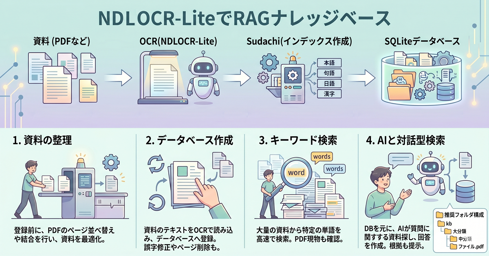
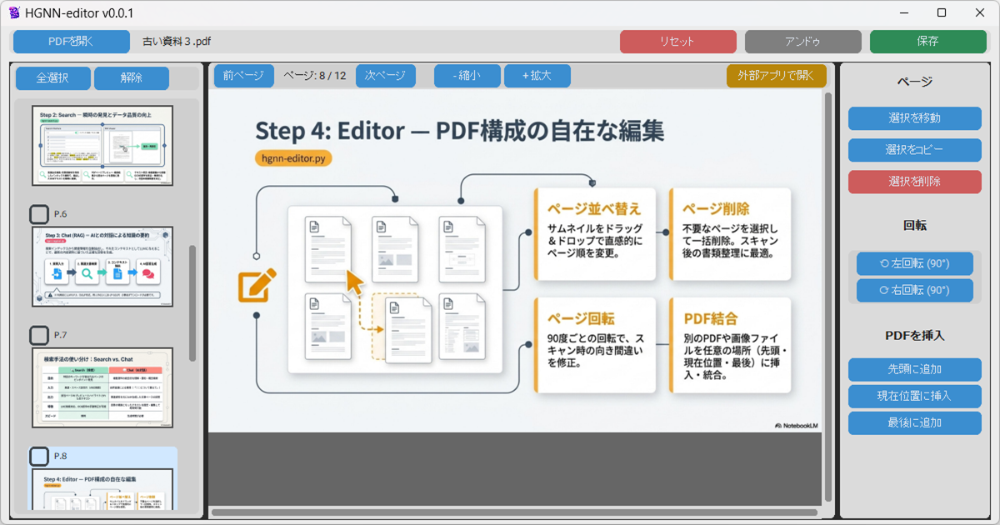
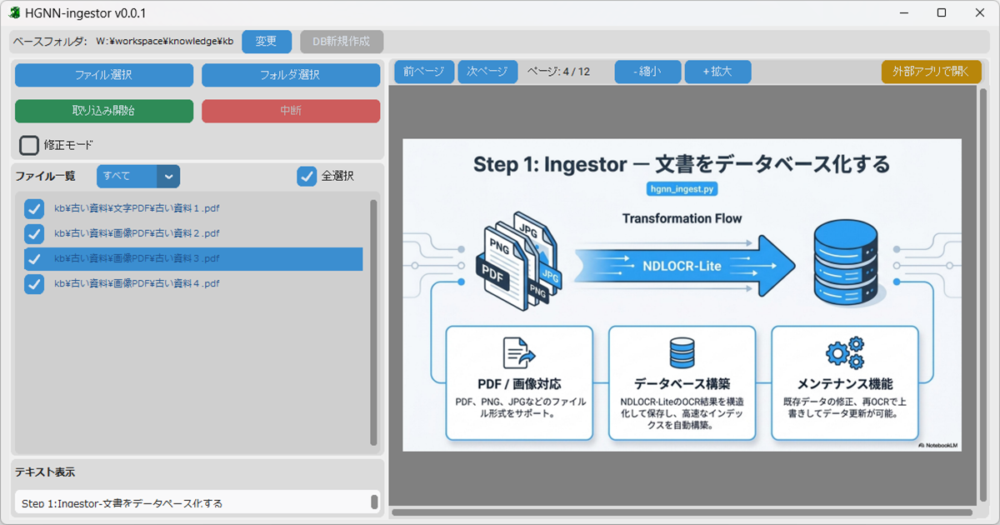
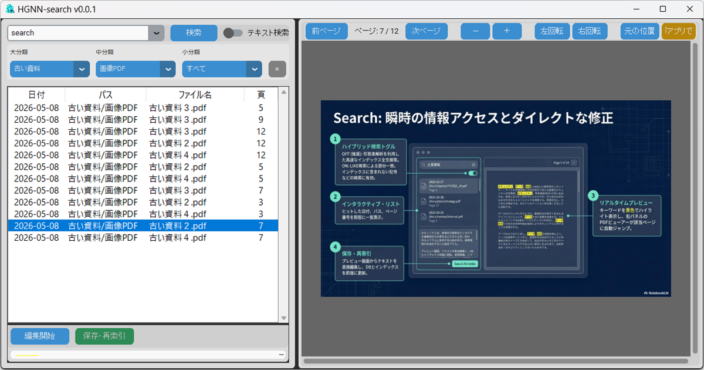

# HGNN(HiGeNagaNeko)のRAGナレッジベース

PDFドキュメントをNDLOCR-Lite（国立国会図書館）でOCRして、テキスト検索およびAIによる対話型検索を行うツールです。

<div align="center">

</div>

NDLOCR-Lite（国立国会図書館）を使用することでOCRが以前より楽になりました。プログラムはAIに指示して作ったので、指示ミスによる動作不良があると思います。LLMによっては回答が適切でなかったり、回答がエンドレスで終わらなくて停止が必要な時もあります。PDFが頻繁に変更される用途に向いてないと思います。資料などの変更がないものが良いです。このツールは動作の正確性・完全性を保証するものではありません。使用は自己責任でお願いします。<br><br>
動作確認のためサンプルでkbフォルダにPDFが入ってます。新規に使用するときはフォルダ内をすべて削除して、推奨の構成でフォルダを作成してPDFを置いてください。PDFを取り込むときはデータベース（DB）を新規に作成しなおして下さい。

## アプリケーション概要

Sudachiを使用してインデックス化しています。データベースはSQLiteで構成しています。LlamaIndexなどはインデックス作成に時間がかかるので使用しませんでした（良い方法があるのかもしれませんが...）。なので、あまり精度のよい検索はできてません。検索前にもllmで検索語を適正にすると良いのかも...

1. **HGNN-editor (`hgnn-editor.py`)**
   - PDFのページ構成を編集（並べ替え、削除、回転、結合）するためのツールです。
   - スキャン前の書類整理や、資料の統合に役立ちます。
   - データベースの自動更新はできません。ingestorで再度更新します。

<div align="center">

</div>

2. **HGNN-ingestor (`hgnn-ingestor.py`)**
   - PDFや画像ファイルを読み込み、OCR処理を行ってデータベースを構築します。
   - 新しい資料の追加や、既存データのメンテナンス（OCRテキストの修正）に使用します。

<div align="center">

</div>

3. **HGNN-search (`hgnn-search.py`)**
   - 構築されたデータベースに対して、キーワードによる全文検索を行います。
   - 該当するPDFページをプレビューし、必要に応じてテキストの修正も可能です。

<div align="center">

</div>

4. **HGNN-ragchat (`hgnn-ragchat.py`)**
   - AI（LLM）と対話しながらナレッジベースの内容を検索・要約します。
   - 関連するドキュメントを検索し、それに基づいた回答を生成します。
   - うまく検索しないときは「」または""で囲んでください。囲んだ文字はテキスト一致で検索します。
   - 前回の質問や回答したことを含めて会話が進みます。会話を進めると前回の回答の影響を受けます。回答が適切でないときは、会話をリセットしてください。

<div align="center">

</div>

## 動作要件

- Windows 11
- [WinPython 3.12 (dot版)](https://winpython.github.io/) — インストール不要のポータブルPython環境
  - 本プロジェクトは WinPython の `python/python.exe` を使用して動作確認しています
  - 通常の Python 3.12 でも動作しますが、パスの設定が必要になる場合があります
- NDLOCR-Lite | Sudachi | llama-cpp-python | pypdfium2

## インストール

CodeからZIPファイルをダウンロードして解凍した後、下記のセットアップ用 BATファイル を実行してください。<br>
動作させるにはLLM（AIモデル）を別途ダウンロードする必要があります（約1.2GB）。

```bash
HGNN_setup.bat
```

[HGNN_setupの説明](HGNN_setup_guide.md)

## LLM(AIモデル)のダウンロード

Hugging FaceからLFM2.5-1.2B-JP-Q8_0.ggufをダウンロードします。また、modelsのフォルダに別のモデルを置けば選びなおせます。

```bash
download_model.bat
```

次のモデルも試しました。LM Studioでダウンロードしてmodelsフォルダに置くと利用できます。

- Ministral-3-3B-Instruct-2512-GGUF
- gemma-4-E2B-it-GGUF
- gemma-4-E4B-it-GGUF

## 使い方

### 1. PDFの整理

資料を整理したい場合は `HGNN-editor` を使用します。

- `run_editor.bat` を実行します。
- ページの入れ替え、画像の向きの補正、いらないページの削除などをして保存します。

### 2. データの取り込み

整理したPDFを`HGNN-ingestor` を使って資料を取り込みます。

- `run_ingestor.bat` を実行します。
- 取り込みたいPDFを選択し、「取り込み開始」を押すとOCR処理が始まります。
- フォルダの階層は後述の構成にするのが望ましいです。

### 3. 検索と閲覧

取り込まれたデータは `HGNN-search` で確認できます。

- `run_search.bat` を実行します。
- 検索窓に単語を入力すると、該当ページがリストアップされます。

### 4. AIとの対話

ナレッジベースに質問したい場合は `HGNN-ragchat` を使用します。

- `run_ragchat.bat` を実行します。
- 下部の入力欄に質問を入力すると、AIが関連資料を探して回答します。

## 推奨されるフォルダ構成

本システムはフォルダ階層を「大分類 / 中分類 / 小分類（ファイル名）」として認識します。
検索性を高めるため、以下のような **2階層のフォルダ構成** にした上で、各フォルダ内にPDFファイルを配置することを推奨します。

```text
kb (ベースフォルダ)
├── 01_プロジェクトA (大分類)
│   ├── 01_仕様書 (中分類)
│   │   └── 要件定義書.pdf (小分類/ファイル名)
│   └── 02_議事録 (中分類)
│       └── 2026-05-04_会議.pdf
└── 02_製品マニュアル (大分類)
    └── 01_取扱説明書 (中分類)
        └── ユーザーガイド.pdf
```

※ フォルダ階層が深すぎると取り込み対象外（範囲外）となる場合があります。原則としてベースフォルダから2階層下までにファイルを配置してください。

## ドキュメント

各ツールの使い方は `docs` 内の各説明書を参照してください。

- [hgnn-editor](docs/hgnn-editor_manual.md)
- [hgnn-ingestor](docs/hgnn-ingestor_manual.md)
- [hgnn-search](docs/hgnn-search_manual.md)
- [hgnn-ragchat](docs/hgnn-ragchat_manual.md)

## License

Copyright (c) 2026 HiGeNagaNeko
This project is licensed under the MIT License - see the [LICENSE](LICENSE) file for details.

## Third-Party Licenses

This software uses the following third-party libraries.

### llama-cpp-python

- **License**: MIT
- **Copyright**: Copyright (c) 2023 Andrei Betlen
- **URL**: https://github.com/abetlen/llama-cpp-python

### SudachiPy

- **License**: Apache 2.0
- **Copyright**: Copyright (c) 2017-2023 Works Applications Co., Ltd.
- **URL**: https://github.com/WorksApplications/SudachiPy

### SudachiDict-core

- **License**: Apache 2.0
- **Copyright**: Copyright (c) 2017-2023 Works Applications Co., Ltd.
- **URL**: https://github.com/WorksApplications/SudachiDict

### pypdfium2

- **License**: Apache-2.0 / BSD-3-Clause
- **Copyright**: Copyright (c) 2022 pypdfium2-team
- **URL**: https://github.com/pypdfium2-team/pypdfium2

### NDLOCR-Lite

- **License**: [Creative Commons Attribution 4.0 International (CC BY 4.0)](https://creativecommons.org/licenses/by/4.0/)
- **Copyright**: Copyright (c) 国立国会図書館 (National Diet Library of Japan)
- **URL**: https://github.com/ndl-lab/ndlocr-lite
- **Changes**: 変更なし
