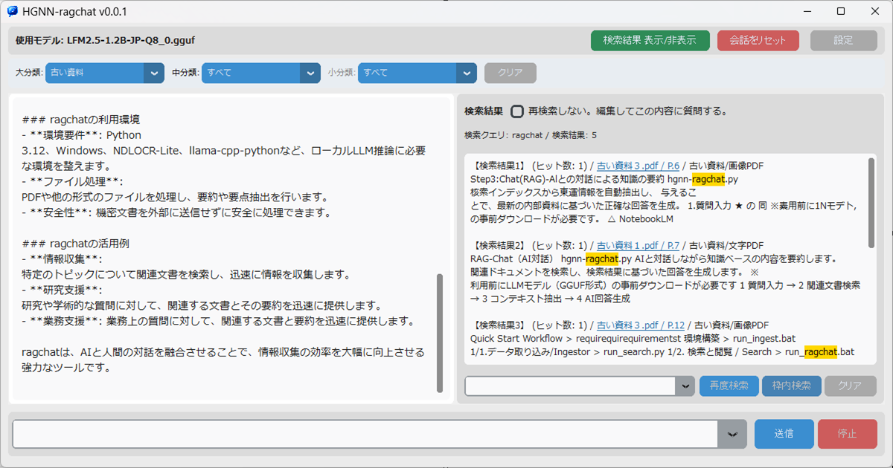

# Chat (hgnn-ragchat.py) AI検索

## 概要

`hgnn-ragchat.py` は、蓄積されたナレッジベース（RAG: Retrieval-Augmented Generation）に対して、AI（LLM）を使って質問・回答を行うためのメインアプリケーションです。
検索インデックスから関連する情報を検索し、その情報をAIに与えることで、ナレッジベースに基づいた回答を得ることができます。  
前回の質問や回答したことを含めて会話が進みます。会話を進めると前回の回答の影響を受けます。回答が適切でないときは、会話をリセットしてください。

## 画面構成と機能

### 1. ヘッダーエリア（画面最上部）

画面の一番上にあり、アプリ全体の状態管理と設定を行います。

- **使用モデル表示**: 現在読み込まれているAIモデル（GGUF形式）のファイル名が表示されます。
- **検索結果 表示/非表示**: 画面右側の「検索結果パネル」を切り替えます。
- **会話をリセット**: チャット履歴と検索結果をクリアし、初期状態に戻します。
- **設定**: AIモデルのパス、システムプロンプト、データベースの場所などの詳細設定を開きます。

### 2. フィルターエリア（ヘッダー直下）

検索対象を特定のカテゴリに絞り込むためのエリアです。

- **大分類 / 中分類 / 小分類**: フォルダ構造に基づいたカテゴリ選択が可能です。選択すると、その下の階層の選択肢が動的に更新されます。
- **クリア**: すべてのフィルターを解除して「すべて」の状態に戻します。

### 3. チャットパネル（左側）

AIとの対話を表示するメインエリアです。

- **メッセージ表示**: あなたの質問、AIの回答、システムメッセージが時系列で表示されます。
- **[システム] メッセージ**: 検索の実行状況やモデルの読み込み状態などを通知します。

### 4. 検索結果パネル（右側）

AIが回答するために参照したテキストを表示します。

- **検索結果 (編集可)**: 検索されたドキュメントの一部が表示されます。
- **検索単語**: 検索に使用された単語が表示されます。意図しない単語あるときは再度検索に正しい単語をいれて再度検索します。OR条件で検索します。
- **再検索しない（チェックボックス）**:
  - **OFF（通常）**: 質問のたびに最適な情報を自動で再検索します。
  - **ON**: 現在表示されているテキストを固定し、それを元に質問を繰り返せます。表示されているテキストに間違いがあれば編集して「この内容について教えて」といった使い方が可能です。
- **検索入力**: 単語を空白でつなげて入力します。OR条件で検索します。「」または""で囲んだ文字はテキスト一致検索します。うまく検索しないときは囲んでください。
- **再度検索 / 枠内検索**: 表示されているテキストに対して、手動での再検索やキーワードハイライトが可能です。
- **リンク機能**: 青い下線のあるファイル名をクリックするとビューアーで開き、右クリックで外部アプリでの編集などが可能です。

### 5. 入力エリア（画面最下部）

質問を入力し、送信するためのエリアです。「」または""で囲んだ文字はテキスト一致検索します。うまく検索しないときは囲んでください。

- **ステータスインジケーター（●）**: AIが思考中（生成中）は赤く点滅します。
- **入力欄**: 質問を入力します。過去の質問履歴から選択することも可能です。
- **送信ボタン**: 質問を送信します。Enterキーでも送信可能です。
- **停止ボタン**: AIの回答生成を途中で中断します。LLMの回答が終わらないときは中断してください。

## 基本的な使い方

1. **質問を入力**: 下部の入力欄に知りたいことを入力し、「送信」を押します。
2. **検索と回答**: アプリが自動で知識DBから関連箇所を探し出し、右パネルに表示します。その後、AIがその内容を読んで回答を生成します。
3. **詳細確認**: 回答の根拠が気になる場合は、右パネルのリンクをクリックして実際のPDFを確認してください。
